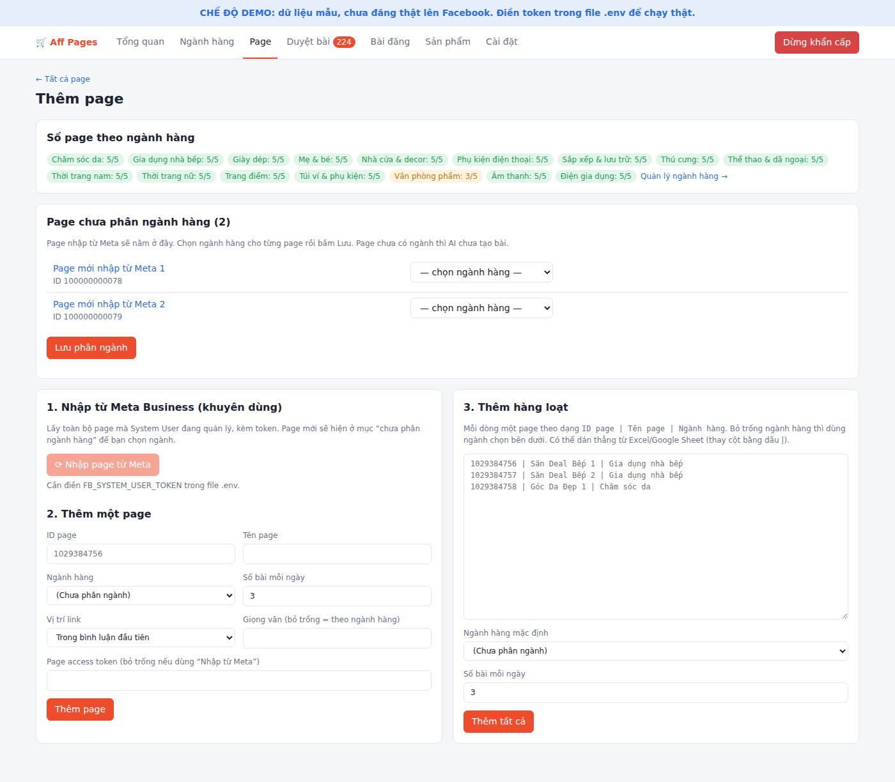
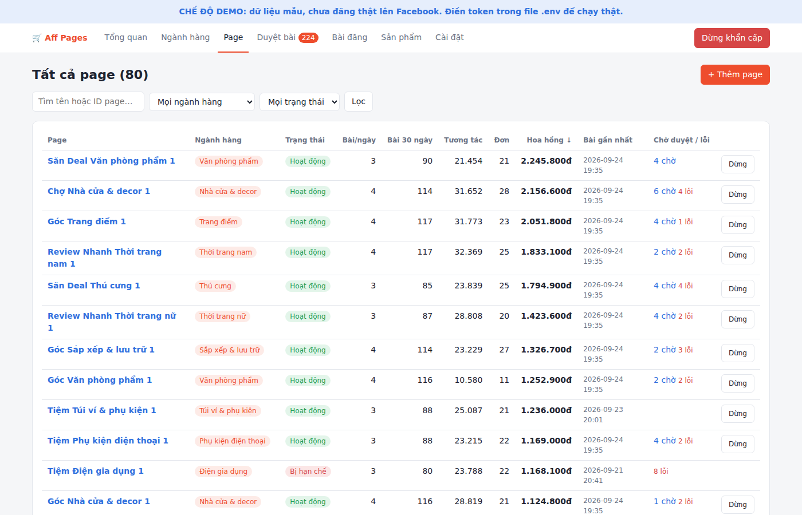

# Aff Pages: quản lý 80 fanpage Facebook chạy affiliate Shopee

Web app để **AI làm việc hằng ngày, bạn chỉ kiểm soát**. Chạy tốt từ 80 đến 500 page.

0. **Ngành hàng**: chia page theo ngành (ví dụ 5 page/ngành), mỗi ngành có từ khoá săn sản phẩm riêng; app báo ngành nào đang thiếu page.
1. **Săn sản phẩm** hoa hồng cao trên Shopee Affiliate theo từng ngách (lọc % hoa hồng, sao, lượt bán, từ cấm).
2. **AI viết bài** riêng cho từng page theo giọng văn của page (Claude API), tạo link aff gắn mã page + mã bài.
3. **Tự kiểm duyệt**: gắn cờ bài có từ cấm, thiếu ghi chú tiếp thị liên kết, câu dễ gây hiểu lầm, trùng nội dung giữa các page.
4. **Bạn duyệt** trên trang *Duyệt bài* (duyệt tất cả bài sạch bằng 1 nút, sửa hoặc từ chối bài bị gắn cờ).
5. **Tự đăng** đúng giờ qua Graph API chính thức, rải giờ giữa các page, link đặt trong bài hoặc bình luận đầu.
6. **Báo cáo**: hoa hồng, đơn, tương tác theo ngày / page / ngách / sản phẩm; cảnh báo page bị hạn chế, bài lỗi, page “im lặng”.
7. **Kiểm tra nội dung từng page**: xem mọi bài đã đăng, chờ đăng, lỗi; kéo cả bài đăng tay ngoài app về để kiểm tra.
8. **Nút dừng khẩn cấp** cho toàn bộ hệ thống và nút dừng cho từng page.
9. **Thêm page** 3 cách: nhập từ Meta Business rồi phân ngành, thêm từng page, hoặc dán danh sách hàng loạt (`ID | Tên | Ngành hàng`).
10. **Chi phí**: bảng ước tính chi phí AI + máy chủ theo số page, và chi phí AI thật đo từ số token Claude trả về.

| Tổng quan | Ngành hàng |
|---|---|
|  |  |
| **Thêm page** | **Duyệt bài** |
|  |  |
| **Danh sách page** | **Chi tiết một page** |
|  |  |

## Chạy thử ngay (chế độ DEMO)

Chưa cần token gì, app dùng dữ liệu mẫu 80 page và không đăng thật.

```bash
pip install -r requirements.txt
cp .env.example .env          # sửa ADMIN_PASSWORD
python -m app.demo            # tạo dữ liệu mẫu
uvicorn app.main:app --port 8000
```

Mở http://localhost:8000 và đăng nhập bằng `ADMIN_USER` / `ADMIN_PASSWORD` trong `.env`.

## Chạy thật

### 1. Facebook
1. Đưa cả 80 page vào **Meta Business Portfolio** (business.facebook.com).
2. Tạo **Meta App** loại Business, thêm quyền `pages_show_list`, `pages_manage_posts`, `pages_read_engagement`, `pages_manage_engagement`.
3. Trong Business Settings, tạo **System User** (Admin), gán 80 page + app cho System User, rồi tạo token có các quyền trên.
4. Dán token vào `FB_SYSTEM_USER_TOKEN` trong `.env`.
5. Trong app: **Cài đặt → Đồng bộ page từ Meta**. Sau đó chọn ngách và giọng văn cho từng page.

> Chỉ dùng API chính thức. Không dùng tool đăng nhập bằng cookie hay nick clone, vì đó là cách nhanh nhất để mất page.

### 2. Shopee Affiliate
1. Đăng ký **Open API** trong trang Shopee Affiliate để có `AppID` và `Secret`.
2. Dán vào `SHOPEE_APP_ID`, `SHOPEE_APP_SECRET`.
3. Sửa danh sách ngách + từ khoá ở **Cài đặt**, rồi bấm **Săn sản phẩm**.

Mỗi link aff được gắn subId `p<mã page>` và `b<mã bài>`, nên báo cáo hoa hồng tính được theo từng page và từng bài.
Tên trường API nằm gọn trong `app/services/shopee.py`; nếu Shopee đổi tài liệu, chỉ cần sửa file đó.

### 3. Claude AI (viết bài)
Dán `ANTHROPIC_API_KEY`. Nếu để trống, app dùng caption mẫu có sẵn.

- `AI_MODEL`: mặc định `claude-opus-5` (viết hay nhất). Muốn tiết kiệm: `claude-sonnet-5` hoặc `claude-haiku-4-5`.
- `AI_BATCH=1` (mặc định): bài cho ngày mai được viết qua **Message Batches API**, giảm 50% chi phí,
  thường xong trong vòng 1 giờ, nên job `drafts` chạy từ sáng sớm là kịp.

## Chi phí mỗi tháng (ước tính, 3 bài/page/ngày, dùng Batch API)

| Model | 80 page | 100 page | 250 page | 500 page |
|---|---|---|---|---|
| Claude Opus 5 | ~2,8 triệu đ | ~3,4 triệu đ | ~8,5 triệu đ | ~17 triệu đ |
| Claude Sonnet 5 | ~1,2 triệu đ | ~1,5 triệu đ | ~3,6 triệu đ | ~7,2 triệu đ |
| Claude Haiku 4.5 | ~0,4 triệu đ | ~0,5 triệu đ | ~1,1 triệu đ | ~2,2 triệu đ |

Đã gồm máy chủ VPS (6–24 USD). Facebook và Shopee API miễn phí. Bảng chi tiết theo số page thật nằm trong **Cài đặt → Chi phí**;
sau khi chạy thật, app hiển thị chi phí AI thật đo từ số token.

### 4. Chạy tự động (cron trên VPS)

```cron
# Săn sản phẩm 6h sáng, AI viết bài cho ngày mai lúc 7h sáng (bạn duyệt trong ngày)
0 6 * * *    cd /opt/aff-pages && python -m app.jobs hunt
0 7 * * *    cd /opt/aff-pages && python -m app.jobs drafts
# Đăng bài đến giờ, 5 phút một lần
*/5 * * * *  cd /opt/aff-pages && python -m app.jobs publish
# Cập nhật tương tác + hoa hồng, 2 giờ một lần
0 */2 * * *  cd /opt/aff-pages && python -m app.jobs sync
```

Web app chạy nền bằng `uvicorn app.main:app --host 0.0.0.0 --port 8000` (nên đặt sau Nginx + HTTPS).

## Việc của bạn mỗi ngày (khoảng 15 phút)

1. Mở **Tổng quan**, xem mục *Cần chú ý*.
2. Mở **Duyệt bài**: bấm *Duyệt tất cả bài không bị gắn cờ*, rồi xử lý các bài có cờ ⚠.
3. Mỗi tuần: xem *5 page yếu nhất* và *Theo ngách* để đổi ngách, giọng văn hoặc số bài/ngày.

Khi một page đã ổn định, bật **“Tự duyệt bài không bị gắn cờ”** trong trang page đó để khỏi duyệt tay.

## Cấu trúc

```
app/
  main.py              web app (các trang + thao tác)
  jobs.py              chạy việc tự động từ cron
  demo.py              dữ liệu mẫu
  db.py                SQLite + cài đặt mặc định
  services/
    shopee.py          Shopee Affiliate Open API
    facebook.py        Facebook Graph API
    ai_writer.py       viết caption (Claude) + kiểm duyệt
    pipeline.py        săn sản phẩm → tạo bài → đăng → đồng bộ số liệu
  templates/, static/  giao diện
tests/                 python -m pytest
```
