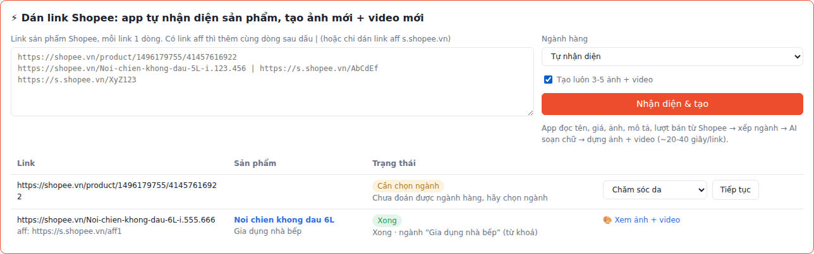
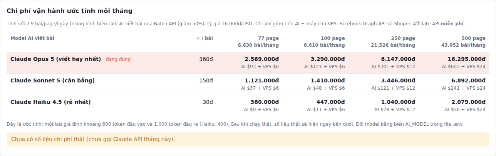
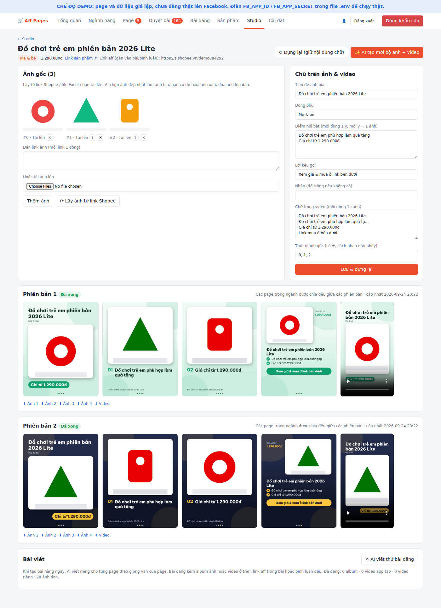
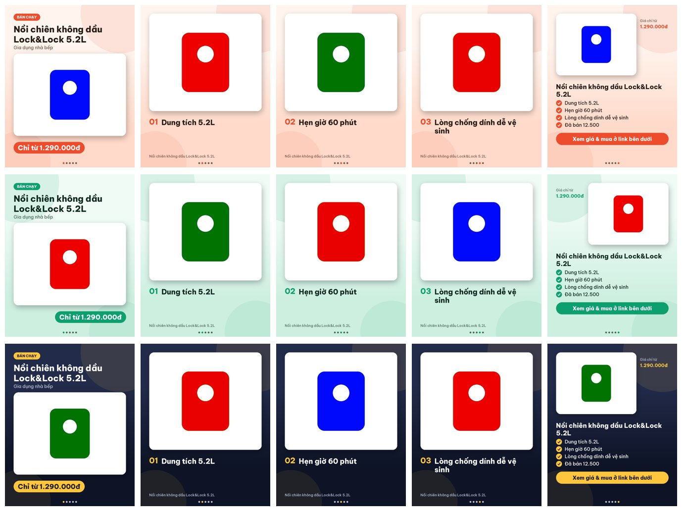
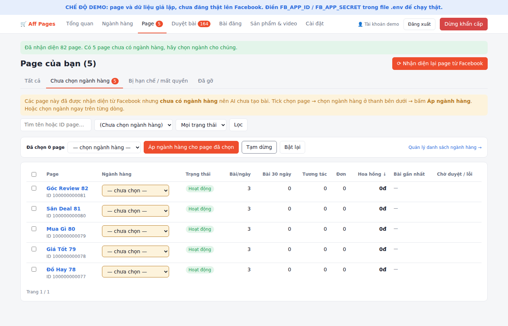
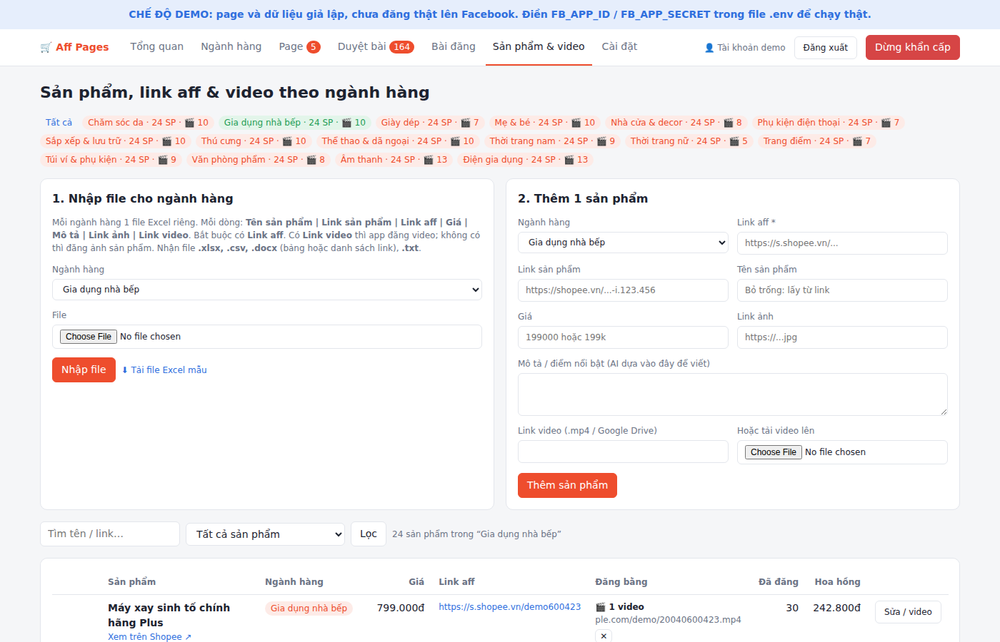
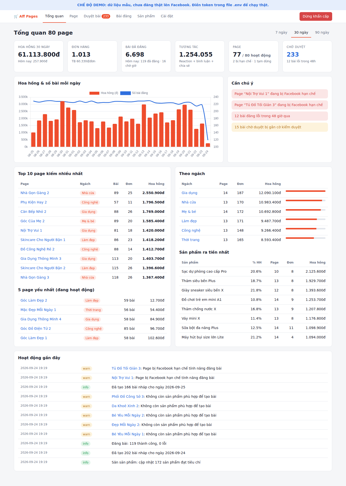
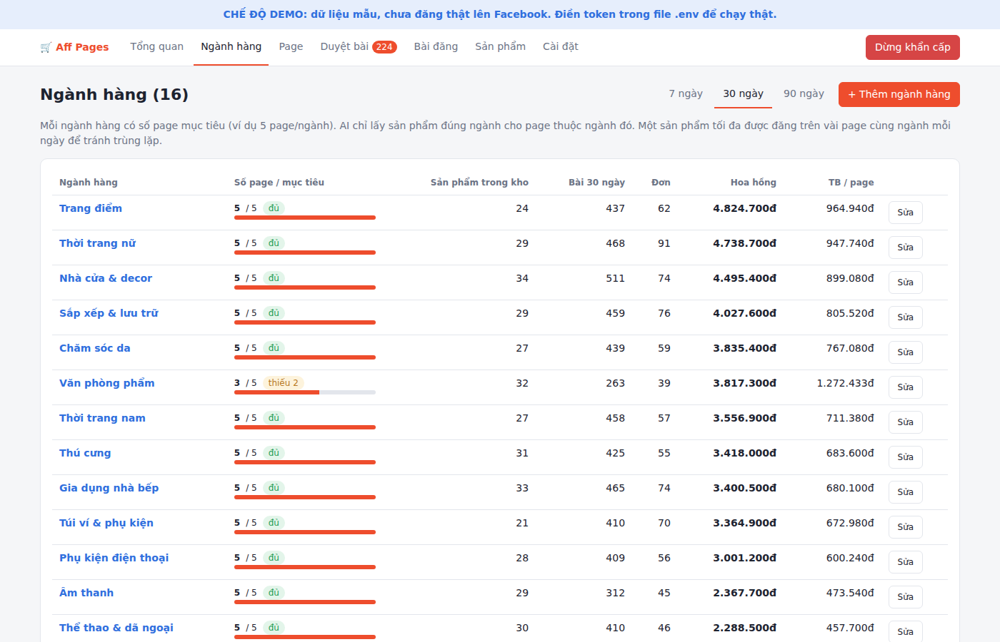
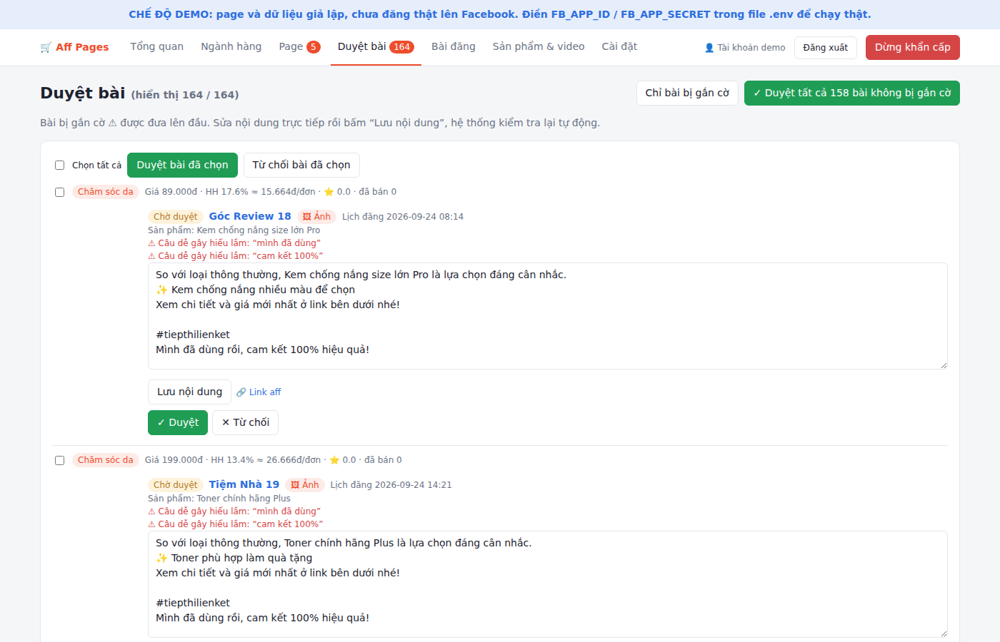
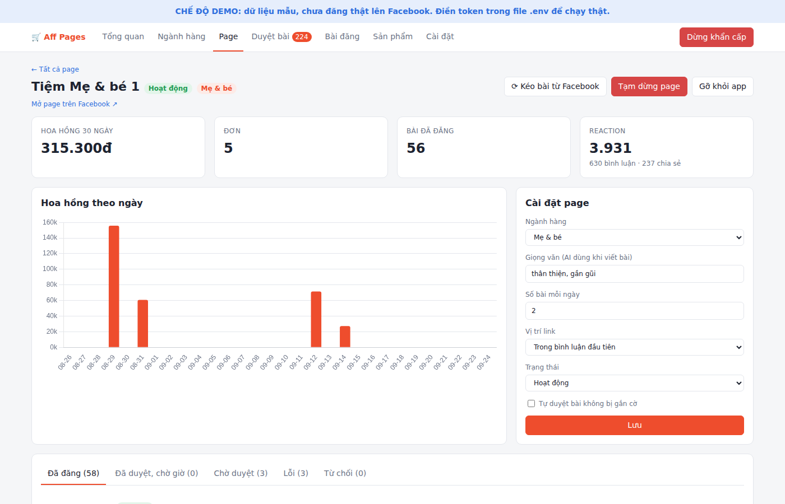

# Aff Pages: quản lý hàng trăm fanpage Facebook chạy affiliate Shopee

Bạn **đăng nhập bằng Facebook cá nhân**, app tự nhận diện tất cả page tài khoản đang quản lý (80, 200, 500 page…).
Bạn chỉ cần: **chọn ngành hàng cho page → nhập file sản phẩm + link aff + video của từng ngành → duyệt bài**.
AI viết bài, app tự đăng **video** (nếu sản phẩm có video) hoặc **ảnh sản phẩm**, và báo cáo kết quả.

## Quy trình

1. **Đăng nhập bằng Facebook**: app lấy danh sách page (kèm quyền đăng bài) của tài khoản. Page mới tạo sau này:
   bấm *Nhận diện lại page từ Facebook* hoặc đăng nhập lại.
2. **Chọn ngành hàng cho page** (trang *Page → Chưa chọn ngành hàng*): tick nhiều page rồi áp 1 ngành,
   hoặc chọn ngay trên từng dòng. Danh sách ngành hàng sửa ở trang *Ngành hàng* (mặc định 16 ngành, mục tiêu 5 page/ngành).
3. **⚡ Dán link Shopee** (trang *Sản phẩm* hoặc *Studio*): dán 1 hay nhiều link (link sản phẩm, link rút gọn
   hoặc link aff `s.shopee.vn`), app tự:
   - đọc **tên, giá, ảnh, mô tả, lượt bán, đánh giá, danh mục** từ Shopee (Open API → trang sản phẩm → thẻ chia sẻ);
   - **xếp ngành hàng** bằng từ khoá (miễn phí), chỉ hỏi AI khi không đoán được; vẫn không rõ thì hỏi bạn;
   - **tạo bộ 3-5 ảnh mới + video mới** (bước 4). Link aff dán cùng dòng sau dấu `|` được gắn vào bài.

   Hoặc **nhập file** cho từng ngành (trang *Sản phẩm*): mỗi ngành 1 file Excel riêng
   (`.xlsx`, `.csv`, `.docx`, `.txt`), hoặc thêm từng sản phẩm. Tải file mẫu ngay trong app.

   | Tên sản phẩm | **Link sản phẩm** (bắt buộc) | Link aff | Giá | Mô tả | Link ảnh (nhiều link) | Link video |
   |---|---|---|---|---|---|---|

   - Sản phẩm được xác định bằng **link sản phẩm** (ảnh, tên lấy từ đây). **Link aff chỉ gắn vào bài hoặc bình luận.**
   - Thiếu tên sản phẩm: app lấy tạm từ link Shopee (hoặc lấy đủ tên/giá/ảnh nếu có Shopee Open API).
   - Video riêng của bạn (không bắt buộc): link `.mp4` / Google Drive hoặc tải file lên → được ưu tiên đăng.
4. **Studio ảnh & video** (tự động cho mỗi sản phẩm):
   - Lấy **ảnh gốc** từ link Shopee (hoặc link ảnh trong file Excel / ảnh bạn tải lên), tải về máy chủ.
   - **AI (Claude) xem ảnh** + thông tin sản phẩm: chọn ảnh đẹp nhất làm bìa, bỏ ảnh xấu / bảng size,
     soạn tiêu đề, 3-4 điểm nổi bật, lời kêu gọi, chữ cho video (chỉ dựa trên thông tin có thật).
   - App **chỉnh ảnh** (cân bằng sáng, tương phản, độ nét, phóng to ảnh nhỏ) và **thiết kế 3-5 ảnh 4:5**
     (ảnh bìa có giá, ảnh điểm nổi bật, ảnh kêu gọi mua) + **1 video ngắn 9:16** (10-15 giây, chuyển cảnh,
     nhạc nền tuỳ chọn trong `data/music/`).
   - Mỗi sản phẩm có **nhiều phiên bản** khác màu / bố cục / ảnh bìa; mỗi page dùng 1 phiên bản riêng để
     các page không đăng ảnh giống hệt nhau. Bạn sửa được chữ trên ảnh rồi bấm *Lưu & dựng lại*.
   - Bài đăng dùng **album 3-5 ảnh** hoặc **video ngắn** (xen kẽ, đổi trong *Cài đặt*).
   - **🎬 Video AI bằng Google Veo 3.1**: app đặt ảnh sản phẩm (không chữ) lên khung 9:16 làm khung đầu,
     Veo tạo chuyển động ~8 giây giữ nguyên sản phẩm (kiểu: quay studio / cận cảnh rồi lùi ra / bối cảnh sử dụng),
     rồi app chèn lại tiêu đề + giá và nối cảnh cuối kêu gọi mua (~10 giây). Có video AI thì bài video ưu tiên dùng.
     Bấm tạo trong Studio, hoặc tick *Tạo video AI* khi dán link. Chưa có giọng đọc (làm sau).
5. **AI viết bài** cho từng page, dựa trên tên, giá, mô tả bạn cung cấp, theo giọng văn của page.
   Nội dung được kiểm duyệt tự động (từ cấm, câu gây hiểu lầm, trùng lặp giữa các page).
6. **Bạn duyệt và sửa bài ngay trên app** (mục *Duyệt bài*, phần **✏️ Sửa bài** ở mỗi bài): sửa nội dung
   (có đếm chữ), chọn đăng **album / video trình chiếu / video AI / 1 ảnh**, chọn phiên bản và **tick chọn từng ảnh**
   đưa vào album, đổi **giờ đăng**, **link aff**, bấm **Lưu & duyệt**; hoặc nhờ **AI viết lại** (ngắn hơn, vui hơn,
   nhấn giá, câu mở đầu cuốn hút, bài mới) kèm yêu cầu riêng. Lưu xong hệ thống tự kiểm duyệt lại. Bạn duyệt ở trang *Duyệt bài* (1 nút duyệt tất cả bài sạch), app **tự đăng** đúng giờ,
   link aff đặt trong bài hoặc ở bình luận đầu tiên.
7. **Theo dõi** ở *Tổng quan*: tương tác, hoa hồng theo page / ngành / sản phẩm; cảnh báo page bị hạn chế,
   mất quyền, ngành chưa có sản phẩm, bài lỗi. Có **nút dừng khẩn cấp** toàn bộ.

| Dán link Shopee → tự nhận diện + tạo ảnh/video | Chi phí theo chế độ AI |
|---|---|
|  |  |
| **Studio: ảnh gốc → 3-5 ảnh đã thiết kế + video** | **Bộ ảnh mẫu (3 phiên bản khác nhau)** |
|  |  |
| **Chọn ngành hàng cho page** | **Sản phẩm, link aff & video** |
|  |  |
| **Tổng quan** | **Ngành hàng** |
|  |  |
| **Duyệt bài** | **Chi tiết một page** |
|  |  |

## Chạy thử online (không cần cài gì)

Dùng gói miễn phí của [Render.com](https://render.com), app chạy trên mạng với link `https://...onrender.com`:

1. Vào https://dashboard.render.com → đăng nhập bằng **GitHub**, cho phép Render đọc repo này.
2. Bấm **New +** → **Blueprint** → chọn repo `hoangpham`, chọn nhánh (branch) chứa code → Render tự đọc file `render.yaml`.
3. Điền **ADMIN_PASSWORD** (mật khẩu vào app). `ANTHROPIC_API_KEY`, `GEMINI_API_KEY` để trống = chạy giả lập, không tốn tiền.
4. Bấm **Apply**, chờ 5-10 phút (cài thư viện + tạo dữ liệu mẫu 82 page) → mở link Render đưa ra, nhập mật khẩu.

Lưu ý gói miễn phí: không ai truy cập 15 phút thì app ngủ, lần mở sau chờ khoảng 1 phút;
mỗi lần khởi động lại, dữ liệu quay về bộ dữ liệu mẫu (chỉ để xem thử, chưa dùng chạy thật).

## Chạy thử ngay (DEMO)

**Cách nhanh nhất:** cài [Python 3.11+](https://www.python.org/downloads/) (Windows: tick *Add python.exe to PATH*),
giải nén file zip, rồi nháy đúp **`run_windows.bat`** (Windows) hoặc chạy `bash run_mac_linux.sh` (Mac/Linux).
Trình duyệt tự mở http://localhost:8000, mật khẩu demo: **`admin123`** (đổi trong file `.env`).

Chạy tay:

Chưa cần Facebook App: app giả lập 1 tài khoản có 82 page, sản phẩm, video và 30 ngày số liệu.

```bash
pip install -r requirements-dev.txt
cp .env.example .env          # đổi ADMIN_PASSWORD, SECRET_KEY
python -m app.demo            # tạo dữ liệu mẫu
uvicorn app.main:app --port 8000
```

Mở http://localhost:8000 → nhập mật khẩu demo (`ADMIN_PASSWORD`).

## Chạy thật

### 1. Tạo Facebook App (1 lần, khoảng 10 phút)
1. Vào https://developers.facebook.com → **Tạo ứng dụng** → loại *Business* (hoặc *Khác → Doanh nghiệp*).
2. Thêm sản phẩm **Facebook Login for Business** (hoặc Facebook Login).
   Ở phần cài đặt, thêm **Valid OAuth Redirect URI**: `https://<tên-miền-của-bạn>/auth/facebook/callback`.
3. Lấy **App ID** và **App Secret** (Cài đặt → Thông tin cơ bản) điền vào `.env`:
   ```
   FB_APP_ID=...
   FB_APP_SECRET=...
   BASE_URL=https://<tên-miền-của-bạn>
   SECRET_KEY=<chuỗi ngẫu nhiên dài>
   ALLOWED_FB_USERS=<Facebook ID của bạn>   # không bắt buộc
   ```
4. Tài khoản Facebook tạo app là **quản trị viên của app** nên dùng được ngay ở chế độ Development,
   **không cần Facebook duyệt app**, vì bạn chỉ quản lý page của chính mình.
5. Khi đăng nhập, Facebook hỏi quyền: chọn **tất cả page** và đồng ý các quyền
   `pages_show_list`, `pages_manage_posts`, `pages_read_engagement`, `pages_manage_engagement`, `business_management`.

Token đăng nhập có hạn khoảng 60 ngày (app hiển thị ngày hết hạn trong *Cài đặt*); token của từng page
không hết hạn nên việc đăng bài vẫn chạy. Chỉ cần đăng nhập lại khi muốn nhận diện page mới sau ngày hết hạn.

> Chỉ dùng API chính thức của Facebook. Không dùng tool đăng nhập bằng cookie hay nick clone, vì đó là cách nhanh nhất để mất page.
> Chỉ đăng video/ảnh bạn có quyền sử dụng.

### 2. Claude AI
Dán `ANTHROPIC_API_KEY`. Nếu để trống, app dùng nội dung mẫu. Chọn **Chế độ AI** trong *Cài đặt*:

| Chế độ | Xếp ngành | Chữ trên ảnh/video (AI xem ảnh) | Viết bài | ≈ / bài | ≈ / bộ ảnh+video |
|---|---|---|---|---|---|
| **Tiết kiệm nhất** (mặc định) | Haiku 4.5 | Haiku 4.5, ảnh thu nhỏ 512px | Haiku 4.5 | ~35đ | ~110đ |
| Cân bằng | Haiku 4.5 | Haiku 4.5 | Sonnet 5 (effort thấp) | ~110đ | ~110đ |
| Chất lượng cao | Haiku 4.5 | Opus 5 | Opus 5 | ~380đ | ~1.250đ |

Cách app tiết kiệm token: xếp ngành bằng từ khoá (0 token); Haiku không bật "suy nghĩ"; ảnh gửi AI thu nhỏ
(≈350 token/ảnh thay vì ~800); AI soạn chữ **1 lần mỗi sản phẩm** rồi dùng lại cho mọi phiên bản ảnh/video;
chỉnh ảnh + dựng video chạy trên máy chủ (0 token); bài hằng ngày viết qua **Batch API** (giảm 50%).

### 3. Google Veo 3.1 (video AI)
Tạo API key tại https://aistudio.google.com/apikey (tài khoản Google Cloud có bật thanh toán), điền `GEMINI_API_KEY`.
Chưa có key thì app **giả lập** (chuyển động ảnh tĩnh) để bạn xem thử luồng, không tốn tiền.

| `VEO_MODEL` | Giá tham khảo | ≈ / video 8 giây |
|---|---|---|
| `veo-3.1-lite-generate-001` (mặc định, rẻ nhất) | ~0,05 USD/giây | ~10.000đ |
| `veo-3.1-generate-preview` (đẹp nhất) | ~0,40 USD/giây | ~83.000đ |

Giá Veo thay đổi theo thời điểm và nguồn công bố khác nhau: **kiểm tra bảng giá Gemini API trước khi chạy nhiều**.
Video AI tốn hơn nhiều so với phần còn lại, nên app mặc định chỉ làm video AI cho phiên bản 1 của mỗi sản phẩm.
API Gemini không cho tắt tiếng khi tạo: app mặc định tắt tiếng Veo (dùng nhạc nền nếu có), đổi trong *Cài đặt*.

### 4. (Tuỳ chọn) Shopee Affiliate Open API
Điền `SHOPEE_APP_ID`, `SHOPEE_APP_SECRET` nếu muốn app tự lấy tên / giá / ảnh / % hoa hồng từ link sản phẩm
và đồng bộ hoa hồng thật. Không bắt buộc: bạn tự nhập link aff là đủ.

### 5. Chạy tự động (cron trên VPS)

```cron
# Xử lý nốt link Shopee đang chờ (nếu app khởi động lại giữa chừng)
*/10 * * * * cd /opt/aff-pages && python -m app.jobs links
# Tạo bộ ảnh + video cho sản phẩm mới (30 sản phẩm/lần, ~10-20 giây/sản phẩm), mỗi giờ từ 0h-5h
0 0-5 * * *  cd /opt/aff-pages && python -m app.jobs media
# AI viết bài cho ngày mai lúc 6h sáng (bạn duyệt trong ngày)
0 6 * * *    cd /opt/aff-pages && python -m app.jobs drafts
# Đăng bài đến giờ, 5 phút một lần
*/5 * * * *  cd /opt/aff-pages && python -m app.jobs publish
# Cập nhật tương tác (+ hoa hồng nếu có Shopee Open API), 2 giờ một lần
0 */2 * * *  cd /opt/aff-pages && python -m app.jobs sync
# Nhận diện page mới mỗi ngày
30 5 * * *   cd /opt/aff-pages && python -m app.jobs pages
```

Web app: `uvicorn app.main:app --host 127.0.0.1 --port 8000` đặt sau Nginx + HTTPS (Facebook Login bắt buộc HTTPS).
Video tải lên nằm trong `data/uploads/`, ảnh/video app tạo nằm trong `data/media/` (mỗi sản phẩm ~3-5 MB mỗi phiên bản),
nên để ổ đĩa VPS đủ lớn. ffmpeg đã có sẵn qua thư viện `imageio-ffmpeg`, không cần cài thêm.

> Lấy ảnh từ link Shopee: Shopee hay chặn truy cập tự động từ máy chủ, nên có sản phẩm sẽ không tự lấy được ảnh.
> Khi đó dán link ảnh vào cột *Link ảnh* của file Excel (mỗi ô nhiều link) hoặc tải ảnh lên trong Studio.
> Chỉ dùng ảnh / video / nhạc bạn có quyền sử dụng.

## Chi phí mỗi tháng (ước tính, 3 bài/page/ngày, dùng Batch API)

| Chế độ AI | 80 page | 100 page | 250 page | 500 page |
|---|---|---|---|---|
| Tiết kiệm nhất (Haiku 4.5) | ~0,5 triệu đ | ~0,6 triệu đ | ~1,4 triệu đ | ~2,8 triệu đ |
| Cân bằng | ~1,1 triệu đ | ~1,3 triệu đ | ~3,1 triệu đ | ~6,1 triệu đ |
| Chất lượng cao (Opus 5) | ~3,9 triệu đ | ~4,8 triệu đ | ~11,8 triệu đ | ~23,6 triệu đ |

Gồm viết bài + tạo bộ ảnh/video (giả định mỗi sản phẩm được đăng ~10 lần) + VPS (8–32 USD). Facebook API miễn phí. Bảng theo số page thật và **chi phí AI thật đo từ token**
nằm trong *Cài đặt → Chi phí*.

## Cấu trúc

```
app/
  main.py              web app (đăng nhập, các trang, thao tác)
  jobs.py              chạy việc tự động từ cron
  demo.py              dữ liệu mẫu
  db.py                SQLite, tự nâng cấp cấu trúc khi cập nhật
  services/
    facebook.py        đăng nhập Facebook, nhận diện page, đăng video / ảnh
    importer.py        đọc file Excel / CSV / Word / text, file mẫu
    catalog.py         kho sản phẩm + video theo ngành hàng
    ai_writer.py       viết caption (Claude, Batch API) + kiểm duyệt
    studio.py          lấy ảnh gốc → AI soạn chữ → dựng ảnh + video, nhiều phiên bản
    creative.py        Claude xem ảnh, soạn chữ trên ảnh / video (JSON)
    designer.py        chỉnh ảnh + thiết kế ảnh 4:5 và khung 9:16 (Pillow, font Be Vietnam Pro)
    video_maker.py     dựng video ngắn, ghép video AI + chữ + cảnh cuối (ffmpeg)
    veo.py             video AI bằng Google Veo 3.1 (Gemini API, image-to-video)
    pipeline.py        nhận diện page → tạo bài → đăng → đồng bộ số liệu
    shopee.py          nhận diện sản phẩm từ link Shopee (+ Open API tuỳ chọn)
    quick_add.py       dán link -> nhận diện -> xếp ngành -> tạo ảnh + video (chạy nền)
    ai_models.py       chọn model Claude theo từng việc (chế độ tiết kiệm / cân bằng / chất lượng)
    costs.py           ước tính chi phí
tests/                 python -m pytest
```
